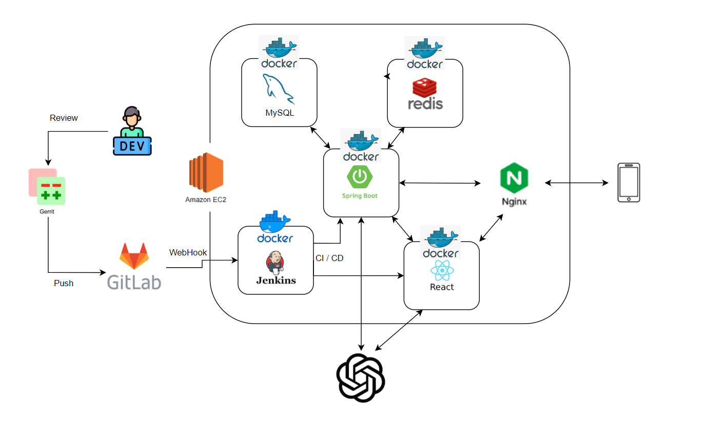

  

<h1 align="center"> 분리수거를 통한 캐릭터 성장 앱, WITT </h1>

<a href="https://bustling-trade-bc8.notion.site/SSAFY-D103-b7d35fa82ecb4eeeb14216976439ebd9?pvs=4"> 📒Notion </a>

<h1> 🧷목차 </h1>
<ol>
  <li> <a herf="#section1"> 서비스 소개 </a> </li>
  <li> <a herf="#section2"> 팀원 구성 </a> </li>
  <li> <a herf="#section3"> 기술 스택 </a> </li>
  <li> <a herf="#section4"> 역할 분담 </a> </li>
  <li> <a herf="#section5"> 개발 기간 </a> </li>
  <li> <a herf="#section6"> 서비스 아키텍처 </a> </li>
</ol>

 

<h2 id="section1">👀 1. 서비스 소개 </h2>
WITT는 분리수거에 대한 정보를 잘 모르는 사람을 대상으로 하는 서비스입니다.
 
이미지 분류모델을 통해 분리수거에 대한 각종 퀴즈를 풀며 얻은 재료를 얻을 수 있습니다. 
사용자는 재료를 통해 자신만의 캐릭터를 성장시켜나가는 시뮬레이션 서비스입니다.
 
 

<a href="https://j10d103.p.ssafy.io/"> WITT 서비스 바로 가기 </a>

<h2 id="section2"> 📎2. 팀원 구성 </h2>
<table>
 <tr>
    <td align="center"></td>
    <td align="center"></td>
    <td align="center"></td>
    <td align="center"></td>
   <td align="center"></td>
   <td align="center"></td>
  </tr>
  <tr>
    <td align="center"><a href="https://github.com/Be-HinD"><b>Be-HinD</b></a>
Back-End
</td>
    <td align="center"><a href="https://github.com/twoConstant"><b>twoConstant</b></a>
Back-End
</td>
    <td align="center"><a href="https://github.com/Henry-Cha"><b>Henry-Cha</b></a>
Back-End
</td>
    <td align="center"><a href="https://github.com/3o14"><b>3o14</b></a>
Front-End
</td>
    <td align="center"><a href="https://github.com/jiyeon2536"><b>jiyeon2536</b></a>
Front-End
</td>
    <td align="center"><a href="https://github.com/nks211"><b>nks211</b></a>
Front-End
</td>
  </tr>
</table>

 

 
<h2 id="section3"> 🛠️ 3. 기술 스택 </h2>
<h3> Front-End </h3>

<h3> Back-End </h3>

<h3> Infra </h3>

<h3> Tools </h3>

 

<h2 id="section4">👪 4. 역할 분담 </h2>
<h3> 😁 김정현 </h3>
<ul>
  <li> 유저 검색 및 팔로우 팔로워 서비스 개발 </li>
</ul>

<h3> 😇 이상수 </h3>
<ul>
  <li> Spring Security 및 JWT 적용 </li>
  <li> OAuth2.0 카카오 소셜 로그인 개발 </li>
  <li> 캐릭터 성장 관련 API 개발 </li>
</ul>

<h3> 😌 차성원 </h3>
<ul>
  <li> CI CD 환경 구축 </li>
  <li> SSE 실시간 푸시알림 서비스 개발</li>
</ul>

<h3> 😎 이원주 </h3>
<ul>
  <li> 추가 예정! </li>
</ul>

<h3> 😊 김지연 </h3>
<ul>
  <li> SSE 푸시알림 연결 </li>
  <li> 쓰레기 분류 ChatGPT Vision AI 연결</li>
  <li> 알림함 페이지 </li>
  <li> 퀴즈 페이지 </li>
</ul>

<h3> 🤓 김민우 </h3>
<ul>
  <li> 추가 예정! </li>
</ul>

 
<h2 id="section5"> ⌛ 5. 개발 기간</h2>

  <table>
    <thead>
      <tr>
        <th></th>
        <th>[개발 기간]</th>
      </tr>
    </thead>
    <tbody>
      <tr>
        <td>진행 기간</td>
        <td>2024.03.04 - 2024.04.04</td>
      </tr>
      <tr>
        <td>인원</td>
        <td>6명</td>
      </tr>
      <tr>
        <td>시간</td>
        <td>09:00-18:00</td>
      </tr>
    </tbody>
  </table>
   
  <table>
    <thead>
      <tr>
        <th></th>
        <th>[전문가 리뷰]</th>
      </tr>
    </thead>
    <tbody>
      <tr>
        <td>1회차</td>
        <td>2024.03.06</td>
      </tr>
      <tr>
        <td>2회차</td>
        <td>2024.03.19</td>
      </tr>
      <tr>
        <td>시간</td>
        <td>약 30분</td>
      </tr>
    </tbody>
  </table>

 

<h2 id="section6">⚙️ 6. 서비스 아키텍처 </h2>

